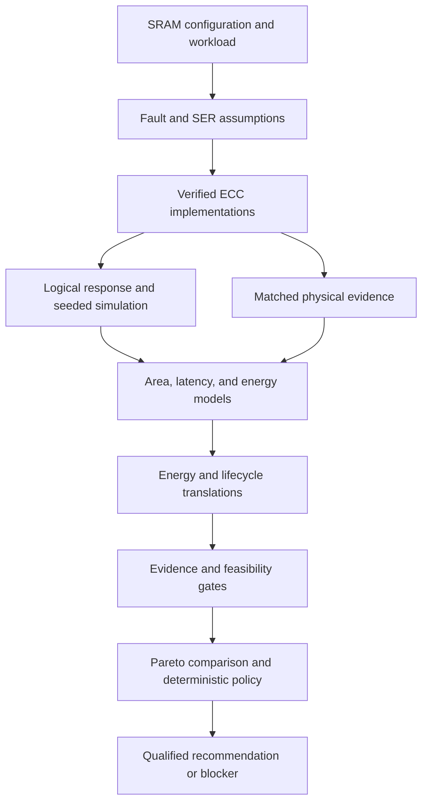

# GREENS

GREENS evaluates SRAM error-correcting-code choices across conditional reliability, implementation cost, operational energy, and sustainability assumptions. SRAM upsets require correction and detection, but stronger ECC adds parity storage, logic, latency, and energy. The useful choice depends on memory organization, workload, fault population, and available evidence. The framework compares these quantities, applies declared feasibility and selection policies, and reports missing evidence explicitly. Existing software/campaign identifiers use **GREEN** and **GREEN-ECC-PHY** and remain stable.

## Current evidence

| Component | Retained evidence | Limit |
|---|---|---|
| Registry | 15 code specifications; 17 implementations; 15 selectable | Two rejected implementations remain visible |
| Matched physical population | 40 inherited SKY130HD/SRAM22 OpenROAD/ORFS runs | Routing, timing, DRC/LVS, and signoff are distinct |
| Activity-qualified energy | 46 post-route E5 ECC-logic records for SECDED/Hsiao | Macro-internal energy is incomplete |
| Fresh OpenRAM 256×72 | Log and partial geometry | Timeout after 10,800 s; exit 137; DRC/LVS/characterization incomplete |
| Absolute reliability | Conditional logical results and explicit models | Physical rates, bitcell mapping, Qcrit qualification, and FIT blocked |
| Lifecycle carbon | Models and sensitivity studies | No qualified SKY130 inventory/yield/lifetime population |
| Overall ranking | Qualified partial comparisons | `NO_GLOBAL_WINNER_QUALIFIED` |

The [evidence map](docs/evidence-map.md), [negative results](docs/experiments/negative_results.md), and campaign status files define the claim boundary.

## Installation and quick start

Use Python 3.10–3.12, GNU Make, and a C++17 compiler. Optional RTL/physical tools are needed only for corresponding checks.

```bash
python -m venv .venv
# Bash/WSL: source .venv/bin/activate
# PowerShell: .\.venv\Scripts\Activate.ps1
python -m pip install -r requirements.txt
make reviewer-smoke
python eccsim.py ecc list
python eccsim.py ecc verify --implementation hsiao-generated-combinational-72-64-v1
python eccsim.py sram simulate --size-kb 64 --word-bits 8 --scheme sec-ded --iterations 100 --seed 17 --json
```

These commands do not rerun a physical campaign. See [environment](docs/reproduction/environment.md), [CLI reference](docs/CLI_REFERENCE.md), and [troubleshooting](docs/TROUBLESHOOTING.md).

## Motivation and architecture

Correction strength alone does not determine a useful ECC. Area/parity overhead affect implementation and memory cost; decode latency constrains clocks and service policy; power and operation counts determine use energy; grid intensity and lifecycle boundaries affect carbon. Reliability depends on SRAM capacity, codeword width, SBU/DBU/MBU topology, physical mapping, and scrub policy.



See [module boundaries](docs/architecture/overview.md) and [evidence model](docs/evidence-model.md).

## ECC architectures

| Architecture | Parameters / capability | Current status |
|---|---|---|
| Extended Hamming SECDED | (72,64); single-bit correction, double-bit detection in its declared universe | Matched evidence; 10 ns feasible, 5 ns infeasible |
| Hsiao SECDED | (72,64); odd-column SECDED | Matched evidence and E5 logic energy; same timing boundary |
| Shortened BCH | (78,64), t=2; bounded two-bit correction | Functionally validated; physical path fails both targets |
| Other primitive BCH entries | (63,51) t=2; (71,64) t=1; (85,64) t=3 | Software constructions with record-specific verification |
| SEC-DAEC / TAEC policies | Extended-Hamming-based adjacent-error policies | Policy-specific; SEC-DAEC counterexample excludes it from matched comparison |
| Synthesized / archived codes | Record-specific dimensions and syndrome tables | Eligibility follows exact implementation verification |
| U0 | Unprotected baseline | Feasible at both matched clock targets |

The historical degree-12 cyclic (63,51) candidate is distinct from validated primitive BCH. See [specifications](docs/ecc/architectures.md) and [catalogue](docs/ECC_CATALOGUE.md).

## Metrics

Existing legacy scores are decision utilities. In `esii.py`, `ESII = U_rel × (U_energy + U_carbon)/2`; reliability improvement uses log-FIT decades and burdens use reciprocal saturation. `NESII` uses the cohort's 5th/95th percentiles and a winsorized 0–100 scale. `gs.py` defines GREEN Score as 100 times a weighted geometric mean of active reliability, carbon, added-latency, and overhead utilities.

Telemetry `EPC` in `parse_telemetry.compute_epc` is estimated gate energy divided by **correction events**, in J/event. It is per corrected bit only when each counted event corrects one bit. [Exact metric formulas](docs/sustainability/metrics.md) document units, constants, absent carbon, and normalization edge cases. [Sustainability model](docs/sustainability-model.md) states qualified carbon boundaries.

## Reliability and selection

SBU flips one logical bit; DBU flips two; MBU/bursts use declared masks or PMFs. Logical adjacency does not establish bitcell adjacency. Absolute SER/FIT additionally needs qualified physical event rates and a verified physical-to-logical map. Hazucha/Qcrit and Poisson scrub calculations are model outputs. Record scrub intervals and scrub-on-correct policy per experiment. See [fault model](docs/reliability/model.md) and [Qcrit](docs/reliability/qcrit.md).

The legacy selector performs NSGA-II nondominated sorting/crowding with deterministic knee, constraint, or carbon-policy decisions. The registry study has a separate lexicographic rule. A partial Pareto front is not a global winner. Explicitly enabled ML under `ml/` advises the baseline; confidence/OOD gates retain fallback. See [optimization](docs/methodology/optimization.md) and [ML advisory](docs/methodology/ml_advisory.md).

## Physical validation, OpenRAM, and SRAM22

The matched flow uses SKY130HD TT/25 °C/1.8 V, clocks 10 ns/5 ns, and seeds 11,13,17,19,23. It retains timing failures and a common documented SRAM22 transition-stage bypass. Open-source RTL-to-GDS evidence does not imply independent foundry signoff.

Fresh OpenRAM did not deliver a qualified 256×72 macro. Inherited SRAM22 macros supply separate physical views; they are not fresh OpenRAM output. E5 covers ECC logic only. See [ORFS](docs/physical_validation/orfs.md), [OpenRAM status](docs/physical_validation/openram.md), and [SRAM22 status](docs/physical_validation/sram22.md).

## Results and reproduction

The retained v3.3 package records 46 qualified logic-energy records, 23 matched operation comparisons, and ten fresh timing-feasible 10 ns SECDED/Hsiao runs alongside the inherited 40-run population. These counts do not establish whole-memory reliability or lifecycle improvement. Sources: [v3.3 status](campaigns/iscas_sustainability_extension/green_v3_3_activity_complete_e5/CAMPAIGN_STATUS.json), [manifest](campaigns/iscas_sustainability_extension/green_v3_3_activity_complete_e5/RUN_MANIFEST.json), and [canonical reproduction](docs/reproduction/canonical_results.md).

```bash
make
make test
python3 -m pytest -q
python scripts/check_artifact.py
```

On Windows use `python -m pytest -q` if `python3` is a Store alias. `make reproduce` intentionally regenerates the registry study; review its diff. Full physical reruns require a new campaign identity and pinned environment. Do not restart the completed v3.3 queue under a new budget.

## Registry-study snapshot

This generated block describes the software study. Later campaigns qualify only their declared physical/activity scopes.

<!-- BEGIN GENERATED:CURRENT_STATUS -->
**Current regenerated evidence:** 15 mathematical code specifications, 17 encoder/decoder implementations, 17 deployment architectures in the registry, and 15 selectable implementations.

The exact-functional and analytical study has 192 scenarios; 192 have a feasible winner and 0 have none. The evidence gate records 15 passing and 2 rejected implementations. Physical objectives remain null, so no physical winner, physical PPA comparison, or measured adaptive break-even is computable.

Source: [`framework_summary.json`](green_ecc_physical_simulation/multi_ecc_evaluation/framework_summary.json) and [`software_study_summary.json`](green_ecc_physical_simulation/multi_ecc_evaluation/software_study_summary.json).
<!-- END GENERATED:CURRENT_STATUS -->

## Limitations

No silicon/radiation measurement, qualified fresh OpenRAM macro, verified fault topology, complete SRAM power model, SKY130-native lifecycle inventory, or global winner is claimed. See [limitations](docs/limitations.md). Negative results remain part of the research record.

## Repository map

| Path | Purpose |
|---|---|
| `eccsim.py`, root models | Public/legacy CLIs, preserved for compatibility |
| `green_ecc_phy/`, `architecture/`, `codeforge/` | Registry, verification, models, and DSE |
| `ml/` | Optional advisory pipeline |
| `rtl/`, `asic/`, `src/` | Hardware and native implementations |
| `configs/`, `config/`, `schemas/`, `data/` | Inputs, contracts, datasets |
| `campaigns/` | Frozen/additive provenance and evidence, including failed runs |
| `green_ecc_physical_simulation/`, `reports/`, `results/` | Registry study and retained results |
| `scripts/`, `tests/` | Reproduction and regression/golden checks |
| `docs/` | Current guides, methods, and history |
| `cleanup/`, `archives/MANIFEST.csv` | Inventory, synchronization decisions, archival provenance |

Imports and source paths remain compatible. Start at [documentation index](docs/README.md); historical milestones are in [history](docs/experiments/history.md). Publication manuscripts remain outside this source repository.

## Citation and license

Use [CITATION.cff](CITATION.cff), the exact commit, and the supporting campaign identifier. No publication DOI is asserted. See [CONTRIBUTING.md](CONTRIBUTING.md) and [MIT License](LICENSE). Third-party technology/macro views retain upstream licensing and provenance.
